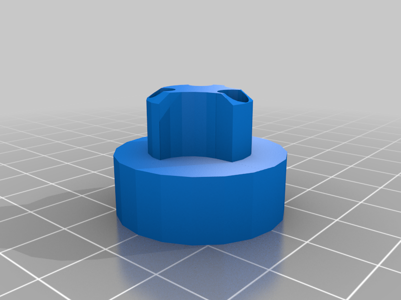
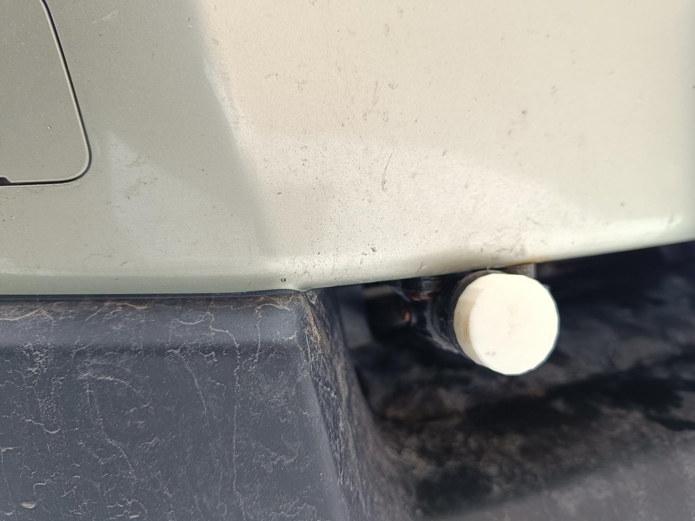
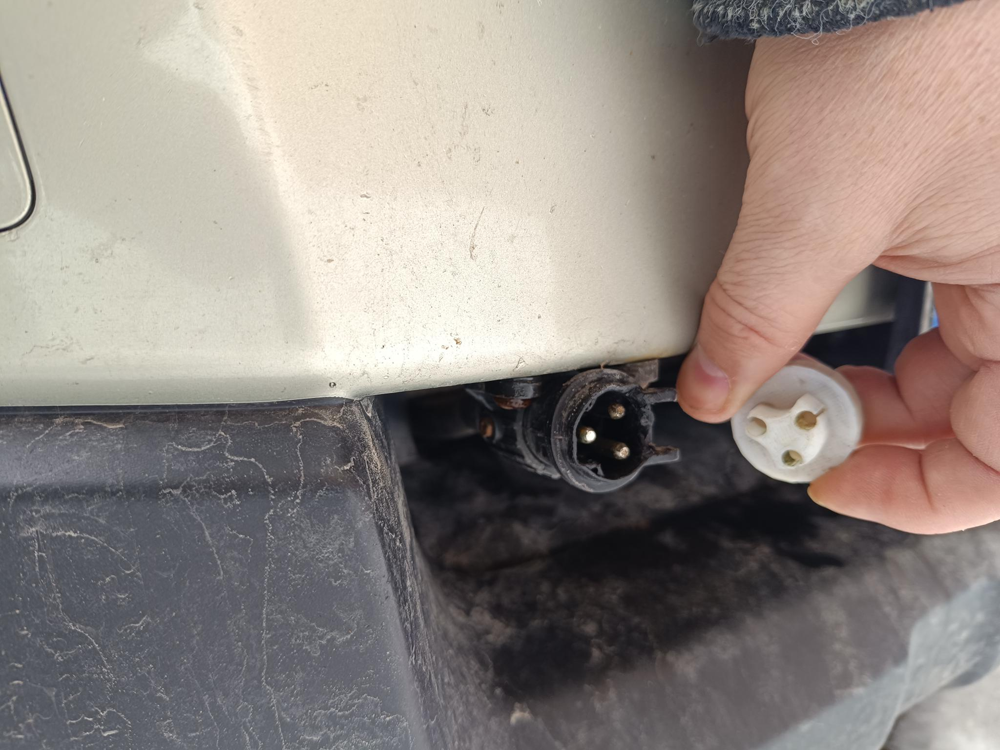

# 3D Printing Showcase

Välkommen till mitt galleri av 3D-printade projekt! Här delar jag bilder på mina utskrifter och ger en kort beskrivning av varje.

## Solderingstation

I did this modell in freeCAD. I was printing out one of the other solderingstation that was on Thingiverse, but the size of the plastic that the solder is on, didn't fitt. So I made my own modell.

Print Settings
Printer brand:
Creality

Printer:
CR-6 SE

Rafts: Doesn't Matter. 
Supports: Yes.

---

## Plug for car heating socket

The cover of the car heating socket broke. So to prevent dirt from going into the outlet, I created this plug that covers. Made this model in Tinkercad.

Print Settings
Printer brand:
Creality

Printer:
CR-6 SE

Rafts: Doesn't Matter. 
Supports: No.

---

